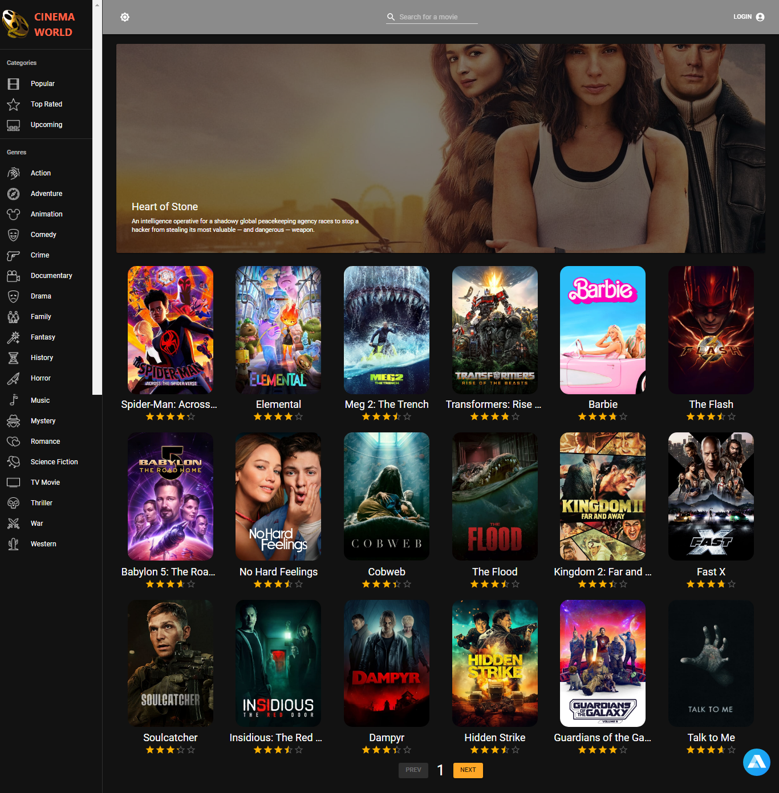
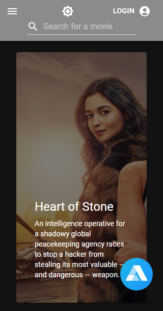
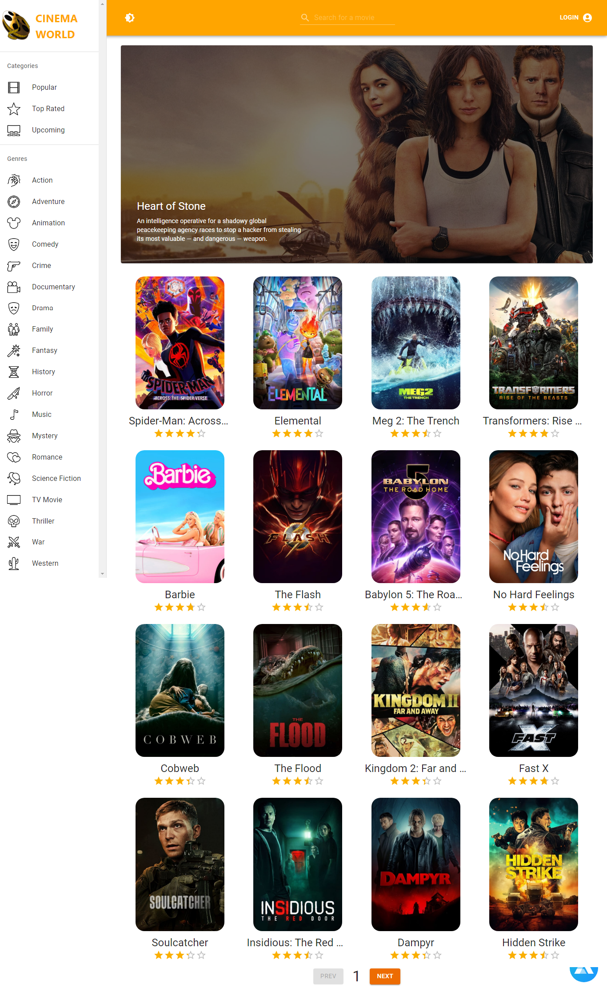

## [CINEMAWORLD](https://cinemaworldmovies.netlify.app/)

  

   <h2 align="center">Cinema World</h2>

  

    This is Cinema World, an app where you can find all of the movies in the world. This application includes user authentication feature, dark mode, movie sorting based on categories or genres, movie addition to favorites or watchlist, an in-app voice assistant A.I. called Alan for easy accessibility of all the app features, and more... 
     
    <a href="https://cinemaworldmovies.netlify.app/"><strong>Visit Webite »</strong></a>
     
     
    <a href="https://github.com/Erudite885/cinema-world">Explore the project</a>
    ·
    <a href="https://github.com/Erudite885/cinema-world/issues">Report Bug</a>
    ·
    <a href="https://github.com/Erudite885/cinema-world/issues">Request Feature</a>
  

 
  

  <h2 >Dark Mode Page View</h2>
  
  

 
  

  <h2 >Mobile Page View</h2>
  
  

 
  

  <h2 >Light Mode Page View</h2>
  
  

## Acknowledgments

Used resources:

* [The Movie DB API Documentation](https://developers.themoviedb.org/3/getting-started/introduction)
* [Alan AI Documentation](https://alan.app/docs/)
* [MUI Library](https://mui.com/)
* [Bossblingzs Logos](https://www.instagram.com/bossblingzs?igshid=ZDc4ODBmNjlmNQ==/)
